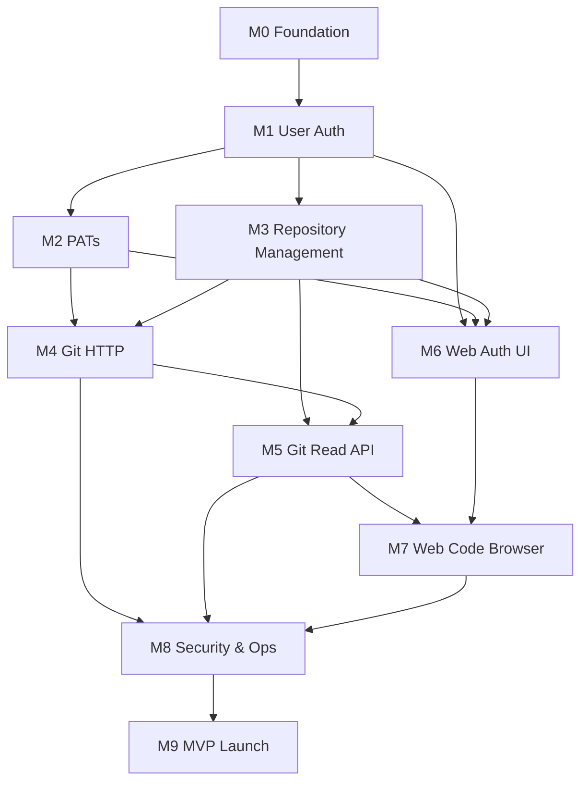
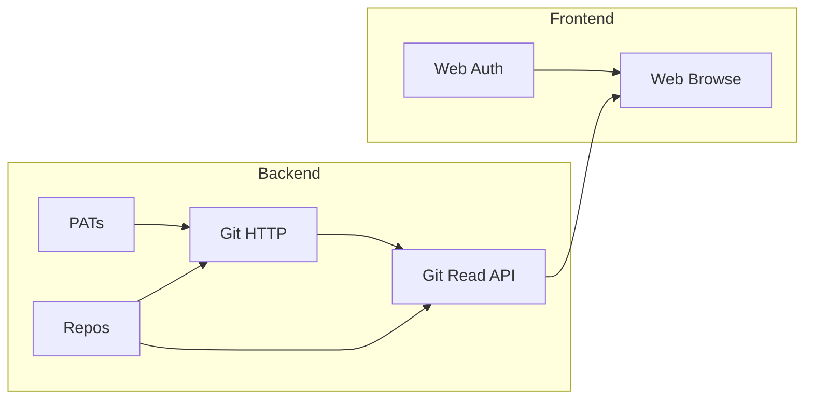

# Deluxe — Milestones

> **Parent document:** [PROJECT.md](PROJECT.md) is the source of truth for requirements and scope.
> This file breaks the entire project into sequenced milestones with deliverables and acceptance criteria.
> When scope changes, update PROJECT.md first, then adjust milestones here.

**Last updated:** 2026-08-18 (full JavaScript stack — no Go)

---

## Overview

```mermaid
flowchart LR
    M0[M0 Foundation] --> M1[M1 Auth]
    M1 --> M2[M2 PATs]
    M2 --> M3[M3 Repos API]
    M3 --> M4[M4 Git HTTP]
    M4 --> M5[M5 Git Read API]
    M5 --> M6[M6 Web Auth]
    M6 --> M7[M7 Web Browse]
    M7 --> M8[M8 Hardening]
    M8 --> M9[M9 MVP Launch]
    M9 --> M10[M10 Enhancements]
    M10 --> M11[M11+ Growth]
```



| Phase | Milestones | Outcome |
|-------|------------|---------|
| **Setup** | M0 | Repo scaffold, DB, dev environment |
| **Core backend** | M1 → M4 | Users can register, create repos, push/pull via Git |
| **Read layer** | M5 | API can read file trees and commits from bare repos |
| **Frontend** | M6 → M7 | Full web UI for auth and code browsing |
| **Ship** | M8 → M9 | Production-ready MVP |
| **Post-MVP** | M10 → M11 | Enhancements and platform growth |

---

## Milestone Dependency Graph



---

## M0 — Foundation

**Status:** Done (scaffold)

**Goal:** Development environment, project skeleton, and database schema in place.

### Deliverables

| # | Item | Location |
|---|------|----------|
| 0.1 | Monorepo structure (`api`, `git-http`, `web`) | `apps/` |
| 0.2 | PostgreSQL migrations (users, sessions, repos, tokens) | `db/migrations/` |
| 0.3 | Docker Compose for local services | `docker-compose.yml` |
| 0.4 | Dev scripts (migrate, init-repo) | `scripts/` |
| 0.5 | PROJECT.md source of truth | `PROJECT.md` |
| 0.6 | Environment config template | `.env.example` |

### Acceptance Criteria

- [x] `make migrate` applies all migrations against local Postgres
- [x] `npm install` succeeds for all workspaces
- [x] Health endpoints respond on api and git-http
- [x] `docker compose up postgres` starts database

### Requirements Mapped

Infrastructure only — enables all subsequent milestones.

---

## M1 — User Authentication

**Goal:** Users can register, log in, and log out. Sessions secure API access.

**Depends on:** M0

**Apps:** `api`

### Deliverables

| # | Item | Package / file |
|---|------|----------------|
| 1.1 | PostgreSQL connection pool | `src/db/postgres.js` |
| 1.2 | User repository (CRUD) | `src/repositories/userRepository.js` |
| 1.3 | Session repository | `src/repositories/sessionRepository.js` |
| 1.4 | Password hashing (bcrypt) | `src/auth/password.js` |
| 1.5 | Session token generation + hashing | `src/auth/session.js` |
| 1.6 | `POST /auth/register` | `src/routes/auth.js` |
| 1.7 | `POST /auth/login` | `src/routes/auth.js` |
| 1.8 | `POST /auth/logout` | `src/routes/auth.js` |
| 1.9 | `GET /users/me` | `src/routes/users.js` |
| 1.10 | Session auth middleware | `src/middleware/auth.js` |
| 1.11 | CORS + logging middleware | `src/middleware/` |
| 1.12 | Input validation (username, email, password) | `src/services/authService.js` |

### Acceptance Criteria

- [x] Register with username, email, password → user created with `status=active`
- [x] Duplicate username or email → 409
- [x] Login with valid credentials → session cookie set (HTTP-only, Secure in prod)
- [x] Login with invalid credentials → 401, generic error message
- [x] `GET /users/me` with valid session → user profile returned
- [x] `GET /users/me` without session → 401
- [x] Logout revokes session; subsequent requests → 401
- [x] Password stored as hash only (NFR-01)

### Status

**Done**

### Requirements Mapped

FR-01, FR-02, FR-03 · NFR-01, NFR-06 · M-01, M-02

### Exit Gate

Auth API fully testable via `curl` or HTTP client without UI.

---

## M2 — Personal Access Tokens

**Goal:** Users can create and revoke PATs for Git and API authentication.

**Depends on:** M1

**Apps:** `api`

### Deliverables

| # | Item | Package / file |
|---|------|----------------|
| 2.1 | PAT repository | `src/repositories/tokenRepository.js` |
| 2.2 | PAT generation (`pat_<random>`) + SHA-256 hash | `src/auth/pat.js` |
| 2.3 | `GET /users/me/tokens` | `src/routes/users.js` |
| 2.4 | `POST /users/me/tokens` | `src/routes/users.js` |
| 2.5 | `DELETE /users/me/tokens/:id` | `src/routes/users.js` |
| 2.6 | PAT auth middleware (for API routes) | `src/middleware/auth.js` |
| 2.7 | Scope validation (`repo_read`, `repo_write`, `api`) | `src/auth/pat.js` |

### Acceptance Criteria

- [ ] Authenticated user creates PAT → plaintext returned once, prefix shown in list
- [ ] PAT list shows name, prefix, scopes, created_at — never full token
- [ ] Revoked PAT → 401 on subsequent use
- [ ] Expired PAT → 401
- [ ] Max 20 PATs per user enforced (409 or 400)
- [ ] PAT with `api` scope can call `GET /users/me`

### Requirements Mapped

FR-04, FR-05 · NFR-02 · M-03

### Exit Gate

PAT lifecycle testable via API; token ready for git-http integration in M4.

---

## M3 — Repository Management

**Goal:** Users can create, list, view, and delete repositories. Bare Git dirs initialized on disk.

**Depends on:** M1

**Apps:** `api`, `scripts/`

### Deliverables

| # | Item | Package / file |
|---|------|----------------|
| 3.1 | Repository repository (data access) | `src/repositories/repoRepository.js` |
| 3.2 | Repo service (create, delete, list, get) | `src/services/repoService.js` |
| 3.3 | Bare repo initialization | `scripts/init-repo.sh` + service call |
| 3.4 | `GET /repos` (owner's repos) | `src/routes/repos.js` |
| 3.5 | `POST /repos` | `src/routes/repos.js` |
| 3.6 | `GET /repos/:owner/:name` | `src/routes/repos.js` |
| 3.7 | `DELETE /repos/:owner/:name` (soft delete) | `src/routes/repos.js` |
| 3.8 | Visibility enforcement (public/private) | `src/services/repoService.js` |
| 3.9 | Private repo → 404 for non-owner | `src/middleware/` + service |
| 3.10 | Reserved name + format validation | `src/services/repoService.js` |

### Acceptance Criteria

- [ ] Create repo → DB row + bare `.git` directory on disk
- [ ] Repo name unique per owner (case-insensitive) → 409 on duplicate
- [ ] List repos returns only current user's repos
- [ ] Get public repo without auth → 200
- [ ] Get private repo without auth → 404
- [ ] Get private repo as owner → 200
- [ ] Soft delete sets `deleted_at`; repo hidden from lists
- [ ] Max 100 repos per user enforced
- [ ] `is_empty=true` on creation

### Requirements Mapped

FR-06, FR-07, FR-10–FR-13 · M-04, M-06, M-07

### Exit Gate

Repos exist in DB and on disk; ready for Git operations in M4.

---

## M4 — Git HTTP (Push / Pull / Clone)

**Goal:** Standard Git CLI can clone, pull, and push via HTTPS using a PAT.

**Depends on:** M2, M3

**Apps:** `git-http`

### Deliverables

| # | Item | Package / file |
|---|------|----------------|
| 4.1 | Route `/{owner}/{repo}.git` | `src/protocol/router.js` |
| 4.2 | `info/refs?service=git-upload-pack` | `src/protocol/uploadPack.js` |
| 4.3 | `POST /git-upload-pack` | `src/protocol/uploadPack.js` |
| 4.4 | `info/refs?service=git-receive-pack` | `src/protocol/receivePack.js` |
| 4.5 | `POST /git-receive-pack` | `src/protocol/receivePack.js` |
| 4.6 | PAT validation + repo ACL | `src/auth/pat.js` |
| 4.7 | `repo_read` scope for clone/pull | `src/auth/pat.js` |
| 4.8 | `repo_write` scope for push | `src/auth/pat.js` |
| 4.9 | Post-receive hook | `src/hook/postReceive.js` |
| 4.10 | Metadata sync (`pushed_at`, `size_bytes`, `is_empty`) | `src/hook/postReceive.js` |
| 4.11 | Size limit enforcement (repo + file) | `src/protocol/receivePack.js` |

### Acceptance Criteria

- [ ] `git clone https://host:9418/{owner}/{repo}.git` works with valid PAT
- [ ] `git push origin main` works with `repo_write` PAT
- [ ] Push without auth → 401
- [ ] Push to private repo with wrong user's PAT → 401/404
- [ ] Push to non-existent repo → 404
- [ ] First push sets `is_empty=false`
- [ ] After push, `pushed_at` and `size_bytes` updated in DB
- [ ] Force push allowed on own repo
- [ ] File > 50 MB or repo > 500 MB → rejected
- [ ] Clone of empty repo handled gracefully (UI instructions in M7)

### Requirements Mapped

FR-14, FR-20–FR-24 · NFR-10, NFR-11, NFR-20, NFR-30 · M-05, M-07

### Exit Gate

End-to-end: register → create repo → create PAT → `git clone` / `git push` succeeds.

---

## M5 — Git Read API

**Goal:** API serves file trees, file content, and commit history from bare repos for the web UI.

**Depends on:** M3, M4 (needs repos with commits)

**Apps:** `api`

### Deliverables

| # | Item | Package / file |
|---|------|----------------|
| 5.1 | Bare repo reader | `src/gitstore/bareRepo.js` |
| 5.2 | Tree walker | `src/gitstore/tree.js` |
| 5.3 | Blob reader | `src/gitstore/blob.js` |
| 5.4 | Commit log reader | `src/gitstore/commits.js` |
| 5.5 | `GET /repos/:owner/:name/tree?ref=&path=` | `src/routes/repos.js` |
| 5.6 | `GET /repos/:owner/:name/blob?ref=&path=` | `src/routes/repos.js` |
| 5.7 | `GET /repos/:owner/:name/commits?ref=` | `src/routes/repos.js` |
| 5.8 | Path traversal protection | `src/gitstore/` + routes |
| 5.9 | Large file truncation / size check | `src/gitstore/blob.js` |
| 5.10 | Language detection for syntax highlight hint | `src/gitstore/blob.js` |
| 5.11 | Branch list endpoint | `src/routes/repos.js` |

### Acceptance Criteria

- [ ] Tree endpoint returns files and directories at given ref
- [ ] Blob endpoint returns file content + language hint
- [ ] Commits endpoint returns SHA, message, author, date
- [ ] Branch list returns all branches
- [ ] Path traversal (`../`) → 400
- [ ] File > 50 MB → 413 or truncated response
- [ ] Binary files returned without language hint
- [ ] Symlinks returned as type `symlink`, not followed
- [ ] Public repo readable without auth; private requires owner session/PAT
- [ ] Response time < 2s for typical repos (NFR-12)

### Requirements Mapped

FR-31–FR-33 · S-01, S-04, S-05 · NFR-04, NFR-12

### Exit Gate

All read endpoints testable via API against a repo with pushed content.

---

## M6 — Web Auth & Dashboard UI

**Goal:** Users can register, log in, manage PATs, and create repos from the browser.

**Depends on:** M1, M2, M3

**Apps:** `web`

### Deliverables

| # | Item | Location |
|---|------|----------|
| 6.1 | App layout (header, nav, auth guard) | `src/components/layout/` |
| 6.2 | Register page + form validation | `src/app/register/` |
| 6.3 | Login page | `src/app/login/` |
| 6.4 | Logout action | `src/lib/auth.js` |
| 6.5 | API client with credentials | `src/lib/api.js` |
| 6.6 | Dashboard — repo list | `src/app/page.jsx` |
| 6.7 | Create repo modal/form | `src/components/repo/CreateRepoForm.jsx` |
| 6.8 | PAT settings page | `src/app/settings/tokens/page.jsx` |
| 6.9 | Create / revoke PAT UI | `src/components/auth/TokenManager.jsx` |
| 6.10 | Error and loading states | `src/components/ui/` |

### Acceptance Criteria

- [ ] User registers and is redirected to dashboard
- [ ] User logs in and sees their repos
- [ ] User creates a repo (name + visibility) from UI
- [ ] User creates and revokes PATs from settings
- [ ] Unauthenticated access to dashboard → redirect to login
- [ ] Form errors displayed (duplicate name, validation)

### Requirements Mapped

FR-30, FR-34 · M-01, M-02, M-03, M-04

### Exit Gate

Full account and repo setup achievable without touching the API directly.

---

## M7 — Web Code Browser

**Goal:** Users can browse repository files, view highlighted code, read README, and see commits.

**Depends on:** M5, M6

**Apps:** `web`

### Deliverables

| # | Item | Location |
|---|------|----------|
| 7.1 | Repo layout (header, tabs: Code, Commits) | `src/components/repo/RepoHeader.jsx` |
| 7.2 | File tree component | `src/components/repo/FileTree.jsx` |
| 7.3 | File viewer with syntax highlighting | `src/components/repo/FileViewer.jsx` |
| 7.4 | README markdown renderer | `src/components/repo/Readme.jsx` |
| 7.5 | Commit list component | `src/components/repo/CommitList.jsx` |
| 7.6 | Branch selector | `src/components/repo/BranchSelector.jsx` |
| 7.7 | Clone URL + PAT setup instructions | `src/components/repo/ClonePanel.jsx` |
| 7.8 | Empty repo state (push instructions) | `src/components/repo/EmptyRepo.jsx` |
| 7.9 | Repo home page (`/:owner/:repo`) | `src/app/[owner]/[repo]/page.jsx` |
| 7.10 | Tree route (`/:owner/:repo/tree/*`) | `src/app/[owner]/[repo]/tree/` |
| 7.11 | Commits route | `src/app/[owner]/[repo]/commits/page.jsx` |
| 7.12 | Large file / binary file handling in UI | `src/components/repo/FileViewer.jsx` |

### Acceptance Criteria

- [ ] Repo home shows README rendered as markdown (if present)
- [ ] File tree navigates directories and opens files
- [ ] Code displayed with syntax highlighting (JS, Python, Go, etc.)
- [ ] Commits page shows history with message, author, date, SHA
- [ ] Branch selector switches ref for tree and commits
- [ ] Empty repo shows `git remote add` + `git push` instructions
- [ ] Clone panel shows HTTPS URL and PAT guidance
- [ ] Private repo not accessible to other users

### Requirements Mapped

FR-31–FR-34 · S-01, S-02, S-03, S-04, S-05 · NFR-12, NFR-31

### Exit Gate

MVP success criteria #5 met: user browses code in browser after pushing via Git.

---

## M8 — Security, Reliability & Operations

**Goal:** Production hardening — rate limits, cleanup jobs, logging, and operational safety.

**Depends on:** M4, M5, M7

**Apps:** `api`, `git-http`, `scripts/`

### Deliverables

| # | Item | Location |
|---|------|----------|
| 8.1 | Rate limiting on auth endpoints | `apps/api/src/middleware/rateLimit.js` |
| 8.2 | Structured logging (request ID, user) | both services |
| 8.3 | Session cleanup job | `scripts/cleanup-sessions.sh` or worker |
| 8.4 | Token cleanup job | `scripts/cleanup-tokens.sh` |
| 8.5 | Deleted repo purge job | `scripts/purge-repos.sh` |
| 8.6 | Repo size reconciliation job | `scripts/reconcile-sizes.sh` |
| 8.7 | Health + readiness endpoints | both services |
| 8.8 | Graceful shutdown | both services |
| 8.9 | HTTPS/TLS configuration docs | `docs/deployment.md` |
| 8.10 | Backup procedure documented | `docs/deployment.md` |

### Acceptance Criteria

- [ ] Auth endpoints rate limited (429 after threshold)
- [ ] Expired sessions cleaned up automatically
- [ ] Soft-deleted repos purged after 7 days
- [ ] Push failure does not corrupt bare repo (NFR-20)
- [ ] Health endpoints report DB connectivity
- [ ] Backup and restore procedure documented

### Requirements Mapped

NFR-03, NFR-05, NFR-20, NFR-21 · §12 Data Lifecycle

### Exit Gate

Platform safe to expose beyond local development.

---

## M9 — MVP Launch

**Goal:** Polished, deployable MVP that meets all success criteria in PROJECT.md §1.

**Depends on:** M8

**Apps:** all

### Deliverables

| # | Item | Location |
|---|------|----------|
| 9.1 | UI polish (consistent design, responsive layout) | `apps/web/` |
| 9.2 | Error pages (404, 401, 500) | `apps/web/` |
| 9.3 | Production Docker Compose / deployment guide | `docs/deployment.md` |
| 9.4 | End-to-end smoke test script | `scripts/smoke-test.sh` |
| 9.5 | README quick start verified | `README.md` |
| 9.6 | MVP checklist sign-off | this file |

### MVP Launch Checklist

| # | Criterion | Milestone |
|---|-----------|-----------|
| ✓ | User registers and logs in | M1, M6 |
| ✓ | User creates public/private repo | M3, M6 |
| ✓ | User generates PAT | M2, M6 |
| ✓ | `git clone`, `git pull`, `git push` work | M4 |
| ✓ | User browses files and commits in browser | M5, M7 |
| ✓ | Private repos hidden from unauthorized access | M3, M4, M5 |
| ✓ | Production hardening applied | M8 |

### Acceptance Criteria

- [ ] `scripts/smoke-test.sh` passes full user journey
- [ ] All P0 (must-have) requirements from PROJECT.md §2 implemented
- [ ] All P1 (should-have) requirements from PROJECT.md §2 implemented
- [ ] Deployable via Docker Compose on a single VPS

### Requirements Mapped

All MVP scope (§2) · MVP Success Criteria (§1)

### Exit Gate

**MVP is shippable.**

---

## M10 — Post-MVP Enhancements (P2)

**Goal:** Nice-to-have features that improve UX and access options.

**Depends on:** M9

### Deliverables

| # | Feature | Requirements |
|---|---------|--------------|
| 10.1 | SSH Git access | N-02 |
| 10.2 | Email verification on signup | N-04, Q-01 |
| 10.3 | Password reset flow | N-04 |
| 10.4 | Polished dashboard (activity, stats) | N-01 |
| 10.5 | Web-based file edit + commit | N-03 |
| 10.6 | Audit event logging | optional entity |
| 10.7 | User account deletion flow | Q-03 |

### Acceptance Criteria

Defined per feature when prioritized.

---

## M11 — Platform Growth

**Goal:** Features that transform Deluxe from a personal tool into a collaborative platform.

**Depends on:** M9 (features can be parallelized after MVP)

**Not in MVP.** Requires PROJECT.md scope update before starting.

### Deliverables

| # | Feature | PROJECT.md ref |
|---|---------|----------------|
| 11.1 | Repository collaborators | §14 Out of Scope |
| 11.2 | Organizations and teams | §14 |
| 11.3 | Pull requests and code review | §14 |
| 11.4 | Issues and wikis | §14 |
| 11.5 | Fork, star, watch | §14 |
| 11.6 | Code search | §14 |
| 11.7 | CI/CD and webhooks | §14 |
| 11.8 | Git LFS | §14 |
| 11.9 | 2FA and SSO | §14 |
| 11.10 | Public third-party API | §14 |

### Acceptance Criteria

Each sub-feature gets its own mini-milestone with acceptance criteria when scoped.

---

## Milestone Summary Table

| ID | Name | Apps | Priority | Depends On |
|----|------|------|----------|------------|
| **M0** | Foundation | all | — | — |
| **M1** | User Authentication | api | P0 | M0 |
| **M2** | Personal Access Tokens | api | P0 | M1 |
| **M3** | Repository Management | api | P0 | M1 |
| **M4** | Git HTTP | git-http | P0 | M2, M3 |
| **M5** | Git Read API | api | P1 | M3, M4 |
| **M6** | Web Auth & Dashboard | web | P0 | M1, M2, M3 |
| **M7** | Web Code Browser | web | P1 | M5, M6 |
| **M8** | Security & Operations | all | P0 | M4, M5, M7 |
| **M9** | MVP Launch | all | P0 | M8 |
| **M10** | Enhancements | all | P2 | M9 |
| **M11** | Platform Growth | all | Future | M9 |

---

## Parallel Work Streams

After M1 completes, these can run in parallel:



| Stream | Owner focus | Milestones |
|--------|-------------|------------|
| **A — Git protocol** | git-http service | M2 → M4 |
| **B — API & data** | api service | M3 → M5 |
| **C — Frontend** | web app | M6 → M7 |

Sync points: M4 needs M2+M3; M7 needs M5+M6; M8 merges all streams.

---

## Tracking Conventions

### Branch naming

```
cursor/m{N}-{short-name}-4ab5
```

Examples: `cursor/m1-user-auth-4ab5`, `cursor/m4-git-http-4ab5`

### PR title format

```
[M{N}] Short description
```

### Status values

| Status | Meaning |
|--------|---------|
| `not-started` | No work begun |
| `in-progress` | Active development |
| `done` | Acceptance criteria met |
| `blocked` | Waiting on dependency or decision |

### Updating this file

When a milestone completes, check off acceptance criteria and update the status column in the summary table.
