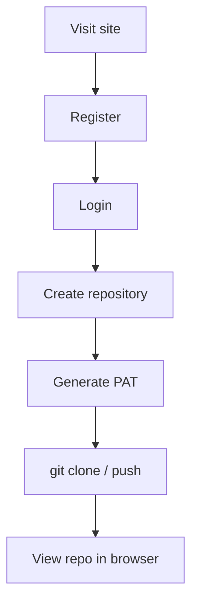
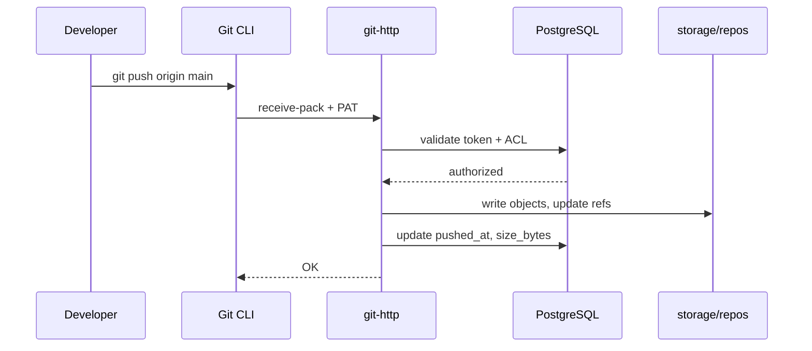
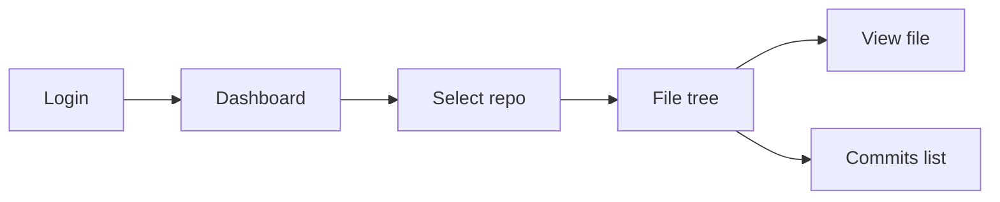
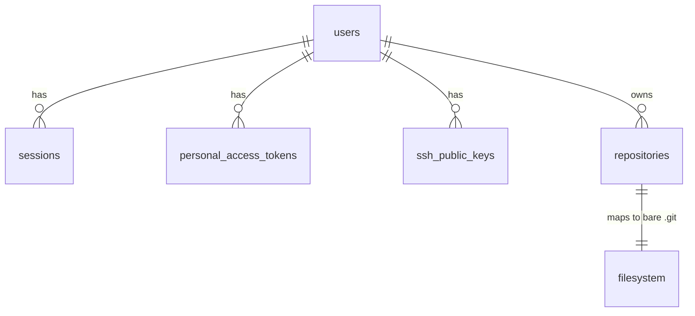
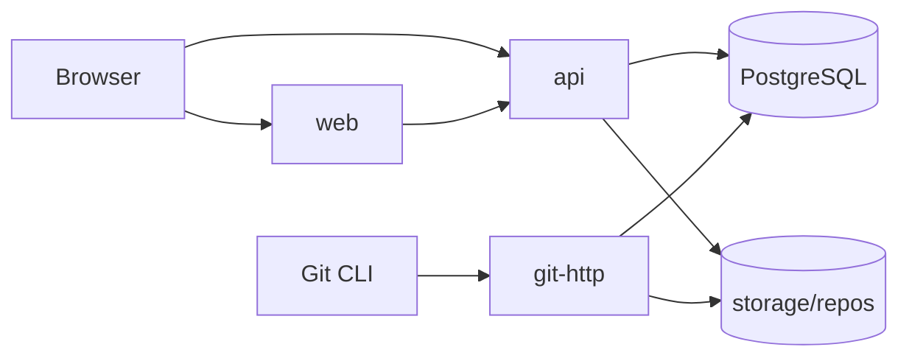

# Deluxe — Project Source of Truth

> **This document is the single source of truth for the Deluxe code hosting platform.**
> When requirements, architecture, or scope conflict with other files, **PROJECT.md wins**.
> Implementation details in `db/migrations/` are authoritative for schema; this doc explains intent.

| Document | Role |
|----------|------|
| **PROJECT.md** (this file) | Product, requirements, architecture, data model, scope |
| `db/migrations/` | Executable schema (must stay in sync with §7) |
| `docs/` | Supplementary deep-dives (must not contradict this file) |
| `README.md` | Quick start and onboarding pointer |

**Last updated:** 2026-08-18

---

## Table of Contents

1. [Vision](#1-vision)
2. [MVP Scope](#2-mvp-scope)
3. [Functional Requirements](#3-functional-requirements)
4. [Non-Functional Requirements](#4-non-functional-requirements)
5. [Assumptions](#5-assumptions)
6. [User Flows](#6-user-flows)
7. [Data Model](#7-data-model)
8. [Architecture](#8-architecture)
9. [API Contract](#9-api-contract)
10. [Project Structure](#10-project-structure)
11. [Edge Cases](#11-edge-cases)
12. [Data Lifecycle](#12-data-lifecycle)
13. [Open Decisions](#13-open-decisions)
14. [Out of Scope](#14-out-of-scope)

---

## 1. Vision

**Deluxe** is a GitHub-like platform where users can **store, version, update, and access code** through standard Git tooling and a web interface.

### MVP Success Criteria

A user can:

1. Register and log in
2. Create a repository (public or private)
3. Generate a personal access token (PAT)
4. `git clone`, `git pull`, and `git push` from their machine
5. Browse repository files and commit history in the browser

---

## 2. MVP Scope

### Must Have (P0)

| ID | Feature |
|----|---------|
| M-01 | User registration and login |
| M-02 | Session-based web authentication |
| M-03 | Personal access tokens for Git over HTTPS |
| M-04 | Create and delete repositories (owner only) |
| M-05 | Git push, pull, clone via HTTPS |
| M-06 | Public and private repository visibility |
| M-07 | Authorization on every Git and API request |

### Should Have (P1)

| ID | Feature |
|----|---------|
| S-01 | Web file tree browser |
| S-02 | Syntax-highlighted file viewer |
| S-03 | README markdown rendering on repo home |
| S-04 | Commit history list (message, author, date, SHA) |
| S-05 | Branch list (read-only; create via Git push) |

### Nice to Have (P2)

| ID | Feature |
|----|---------|
| N-01 | Polished dashboard UI |
| N-02 | SSH Git access |
| N-03 | Web-based file edit and commit |
| N-04 | Email verification and password reset |

### Explicitly Out of MVP

See [§14 Out of Scope](#14-out-of-scope).

---

## 3. Functional Requirements

### Authentication & Authorization

| ID | Requirement |
|----|-------------|
| FR-01 | Users register with email, username, and password |
| FR-02 | Users log in and receive a session (HTTP-only cookie) |
| FR-03 | Users log out (session revoked) |
| FR-04 | Users create and revoke personal access tokens |
| FR-05 | PATs authenticate Git HTTP requests |
| FR-06 | Users access only repos they own (collaborators post-MVP) |
| FR-07 | Private repos hidden from unauthorized users (return 404) |

### Repositories

| ID | Requirement |
|----|-------------|
| FR-10 | User creates a repo with name and visibility |
| FR-11 | Repo name unique per owner (case-insensitive) |
| FR-12 | Creating a repo initializes a bare Git directory on disk |
| FR-13 | User deletes a repo (soft delete, recoverable window) |
| FR-14 | Repo metadata synced on push (size, `pushed_at`, `is_empty`) |

### Git Operations

| ID | Requirement |
|----|-------------|
| FR-20 | Clone via `git clone https://host/{owner}/{repo}.git` |
| FR-21 | Pull via standard Git client |
| FR-22 | Push via standard Git client |
| FR-23 | Auth required for all Git operations |
| FR-24 | `repo_read` scope for clone/pull; `repo_write` for push |

### Web UI

| ID | Requirement |
|----|-------------|
| FR-30 | List user's repositories on dashboard |
| FR-31 | Browse file tree at a branch or commit |
| FR-32 | View file content with syntax highlighting |
| FR-33 | View commit history |
| FR-34 | Display clone URL and PAT setup instructions |

---

## 4. Non-Functional Requirements

### Security

| ID | Requirement |
|----|-------------|
| NFR-01 | Passwords hashed with bcrypt or argon2 |
| NFR-02 | Tokens stored as SHA-256 hashes only |
| NFR-03 | HTTPS in production |
| NFR-04 | Path traversal blocked in API and Git layers |
| NFR-05 | Rate limiting on auth endpoints |
| NFR-06 | Generic login error messages (no user enumeration) |

### Performance (MVP targets)

| ID | Requirement |
|----|-------------|
| NFR-10 | Repos up to 500 MB |
| NFR-11 | Individual files up to 50 MB |
| NFR-12 | File browser loads in < 2s for typical repos |
| NFR-13 | Git operations do not block web UI |

### Reliability

| ID | Requirement |
|----|-------------|
| NFR-20 | Push operations are atomic (no corrupt refs) |
| NFR-21 | Daily backup of bare repos and database |

### Compatibility

| ID | Requirement |
|----|-------------|
| NFR-30 | Standard Git CLI (no custom client) |
| NFR-31 | Modern browsers (Chrome, Firefox, Safari, Edge) |

### Limits (MVP defaults)

| Resource | Limit |
|----------|-------|
| Repos per user | 100 |
| PATs per user | 20 |
| SSH keys per user | 10 (when enabled) |
| Max repo size | 500 MB |
| Max file size | 50 MB |

---

## 5. Assumptions

| # | Assumption |
|---|------------|
| A-01 | Target users are individual developers (not enterprises) |
| A-02 | Git CLI is the primary write interface; web edit is post-MVP |
| A-03 | One owner per repo in MVP; no collaborators |
| A-04 | Git objects live on filesystem; metadata in PostgreSQL |
| A-05 | Default branch is `main` |
| A-06 | No Git LFS in MVP |
| A-07 | Email verification optional at launch |
| A-08 | Single-region deployment for MVP |
| A-09 | Username and repo names are case-insensitive for uniqueness |
| A-10 | Force push allowed on own repos (MVP default) |

---

## 6. User Flows

### Flow A — Registration & First Push



### Flow B — Git Push



### Flow C — Browse Code (Web)



### Flow D — Authentication Paths

| Client | Mechanism | Service |
|--------|-----------|---------|
| Web browser | Session cookie | `api` |
| Git CLI | `Authorization: Bearer pat_...` | `git-http` |
| API scripts | PAT with `api` scope | `api` |

---

## 7. Data Model

### 7.1 Entity List

| Entity | Storage | MVP |
|--------|---------|-----|
| `users` | PostgreSQL | Yes |
| `sessions` | PostgreSQL | Yes |
| `personal_access_tokens` | PostgreSQL | Yes |
| `repositories` | PostgreSQL | Yes |
| `ssh_public_keys` | PostgreSQL | Optional |
| `email_verification_tokens` | PostgreSQL | Optional |
| `password_reset_tokens` | PostgreSQL | Optional |
| `audit_events` | PostgreSQL | Optional |
| `repository_collaborators` | PostgreSQL | No (post-MVP) |
| Git objects (commits, trees, blobs) | Filesystem | Yes |

### 7.2 Relationships



| From | To | Cardinality |
|------|----|-------------|
| User | Repository | 1:N (owner) |
| User | Session | 1:N |
| User | PAT | 1:N |
| User | SSH key | 1:N |
| Repository | Bare Git dir | 1:1 |

### 7.3 Schema Summary

> **Authoritative SQL:** `db/migrations/`

#### `users`

| Column | Type | Notes |
|--------|------|-------|
| id | UUID PK | |
| username | VARCHAR(39) | Unique (case-insensitive), format enforced |
| email | VARCHAR(255) | Unique (case-insensitive) |
| email_verified | BOOLEAN | Default false |
| password_hash | VARCHAR(255) | bcrypt/argon2 |
| display_name | VARCHAR(100) | Optional |
| status | ENUM | pending, active, suspended, deleted |
| deleted_at | TIMESTAMPTZ | Soft delete |

#### `sessions`

| Column | Type | Notes |
|--------|------|-------|
| id | UUID PK | |
| user_id | UUID FK → users | CASCADE on delete |
| token_hash | CHAR(64) | SHA-256 of session token |
| expires_at | TIMESTAMPTZ | |
| revoked_at | TIMESTAMPTZ | Set on logout |

#### `repositories`

| Column | Type | Notes |
|--------|------|-------|
| id | UUID PK | |
| owner_id | UUID FK → users | |
| name | VARCHAR(100) | Unique per owner |
| visibility | ENUM | public, private |
| default_branch | VARCHAR(255) | Default `main` |
| storage_path | TEXT | Immutable; e.g. `storage/repos/{uuid}.git` |
| is_empty | BOOLEAN | Until first push |
| size_bytes | BIGINT | Updated on push |
| pushed_at | TIMESTAMPTZ | Last successful push |
| deleted_at | TIMESTAMPTZ | Soft delete |

#### `personal_access_tokens`

| Column | Type | Notes |
|--------|------|-------|
| id | UUID PK | |
| user_id | UUID FK → users | |
| name | VARCHAR(100) | User label |
| token_prefix | CHAR(8) | For UI identification |
| token_hash | CHAR(64) | SHA-256; plaintext shown once |
| scopes | ENUM[] | repo_read, repo_write, api |
| expires_at | TIMESTAMPTZ | Optional |
| revoked_at | TIMESTAMPTZ | |

#### `ssh_public_keys` (optional)

| Column | Type | Notes |
|--------|------|-------|
| id | UUID PK | |
| user_id | UUID FK → users | |
| fingerprint | CHAR(47) | Globally unique among active keys |
| public_key | TEXT | Full OpenSSH line |
| revoked_at | TIMESTAMPTZ | |

### 7.4 Indexes

| Table | Index | Purpose |
|-------|-------|---------|
| users | `LOWER(username)` UNIQUE WHERE deleted_at IS NULL | Login, profile URLs |
| users | `LOWER(email)` UNIQUE WHERE deleted_at IS NULL | Login, recovery |
| sessions | `token_hash` UNIQUE WHERE revoked_at IS NULL | Session lookup |
| repositories | `(owner_id, LOWER(name))` UNIQUE WHERE deleted_at IS NULL | Namespace |
| repositories | `storage_path` UNIQUE | Filesystem mapping |
| personal_access_tokens | `token_hash` UNIQUE WHERE revoked_at IS NULL | Git/API auth |
| ssh_public_keys | `fingerprint` UNIQUE WHERE revoked_at IS NULL | Prevent key reuse |

### 7.5 Constraints

| Rule | Enforcement |
|------|-------------|
| Username format | `^[a-zA-Z0-9]([a-zA-Z0-9-]{0,37}[a-zA-Z0-9])?$` |
| Repo name format | Alphanumeric, `.`, `_`, `-`; no leading/trailing `-` or `.` |
| Reserved repo names | settings, admin, api, new, login, signup |
| Token storage | Hash only; never plaintext in DB |
| Repo delete | App-orchestrated: soft-delete → purge after retention |
| Owner delete | RESTRICT if repos exist; delete repos first |

### 7.6 Authorization Matrix

| Actor | Public repo | Private repo |
|-------|-------------|--------------|
| Anonymous | Read (web + clone) | 404 |
| Owner (session) | Read + write | Read + write |
| PAT `repo_read` | Read | Read (owner's repos) |
| PAT `repo_write` | Write | Write (owner's repos) |

---

## 8. Architecture

### 8.1 Services

| Service | Port | Stack | Responsibility |
|---------|------|-------|----------------|
| `web` | 3000 | Next.js 15, React 19, TypeScript | UI |
| `api` | 8080 | Go 1.22 | REST API, sessions, metadata |
| `git-http` | 9418 | Go 1.22 | Git smart HTTP (clone, push, pull) |
| `postgres` | 5432 | PostgreSQL 16 | Metadata |

### 8.2 Data Stores

| Store | Contents |
|-------|----------|
| PostgreSQL | Users, sessions, tokens, repo metadata |
| `storage/repos/` | Bare Git repositories (runtime, not in git) |

### 8.3 Deployment Topology



### 8.4 Security Boundaries

- All Git operations require PAT authentication
- Private repos return **404** to unauthorized callers (not 403)
- Passwords and tokens stored as hashes only
- Path traversal blocked at API and Git layers
- Symlinks in repos displayed as metadata; not followed for security

### 8.5 Key Design Decisions

| Decision | Choice | Rationale |
|----------|--------|-----------|
| Git content in DB? | No — filesystem bare repos | Standard, performant, Git-native |
| Repo identity | `(owner_id, name)` + stable `storage_path` | Rename-safe filesystem layout |
| Soft delete | Users and repos | Recovery + audit |
| Monorepo | 3 apps in one repo | Simpler MVP development |
| Token format | `pat_<random>` | Clear prefix for identification |

---

## 9. API Contract

### 9.1 REST Endpoints (planned)

#### Auth

| Method | Path | Auth | Description |
|--------|------|------|-------------|
| POST | `/auth/register` | None | Create account |
| POST | `/auth/login` | None | Create session |
| POST | `/auth/logout` | Session | Revoke session |

#### Users

| Method | Path | Auth | Description |
|--------|------|------|-------------|
| GET | `/users/me` | Session | Current user profile |
| GET | `/users/me/tokens` | Session | List PATs |
| POST | `/users/me/tokens` | Session | Create PAT (plaintext returned once) |
| DELETE | `/users/me/tokens/:id` | Session | Revoke PAT |

#### Repositories

| Method | Path | Auth | Description |
|--------|------|------|-------------|
| GET | `/repos` | Session | List user's repos |
| POST | `/repos` | Session | Create repo |
| GET | `/repos/:owner/:name` | Session/PAT | Repo detail |
| DELETE | `/repos/:owner/:name` | Session | Soft delete repo |
| GET | `/repos/:owner/:name/tree` | Session/PAT | File tree at ref |
| GET | `/repos/:owner/:name/blob` | Session/PAT | File content at ref |
| GET | `/repos/:owner/:name/commits` | Session/PAT | Commit history |

### 9.2 Git HTTP

```
https://{host}:9418/{owner}/{repo}.git
```

| Endpoint | Git command |
|----------|-------------|
| `GET /info/refs?service=git-upload-pack` | clone, pull |
| `POST /git-upload-pack` | clone, pull |
| `GET /info/refs?service=git-receive-pack` | push |
| `POST /git-receive-pack` | push |

**Auth header:** `Authorization: Bearer pat_<token>`

### 9.3 Error Conventions

| Code | When |
|------|------|
| 400 | Invalid input |
| 401 | Missing or invalid credentials |
| 404 | Resource not found OR unauthorized private resource |
| 409 | Duplicate username, repo name, or SSH fingerprint |
| 413 | File or repo exceeds size limit |
| 429 | Rate limited |

---

## 10. Project Structure

```
Deluxe/
├── PROJECT.md              ← this file (source of truth)
├── README.md               ← quick start
├── apps/
│   ├── api/                ← REST API
│   ├── git-http/           ← Git smart HTTP
│   └── web/                ← Next.js frontend
├── db/migrations/          ← PostgreSQL schema
├── docs/                   ← supplementary docs
├── scripts/                ← dev.sh, migrate.sh, init-repo.sh
├── storage/repos/          ← bare Git repos (gitignored)
├── docker-compose.yml
├── go.work
├── Makefile
└── .env.example
```

### `apps/api` internal packages

| Package | Responsibility |
|---------|----------------|
| `auth` | Sessions, JWT, PAT, password hashing |
| `config` | Environment configuration |
| `db` | PostgreSQL connection |
| `handler` | HTTP handlers |
| `middleware` | Auth, CORS, logging |
| `model` | Domain types |
| `repository` | Data access layer |
| `service` | Business logic |
| `gitstore` | Read-only Git filesystem access |

### `apps/git-http` internal packages

| Package | Responsibility |
|---------|----------------|
| `auth` | PAT validation + repo ACL |
| `protocol` | upload-pack / receive-pack |
| `hook` | Post-receive metadata sync |

### `apps/web` routes

| Route | Page |
|-------|------|
| `/` | Dashboard |
| `/login` | Login |
| `/register` | Sign up |
| `/settings/tokens` | PAT management |
| `/:owner/:repo` | Repo home (README) |
| `/:owner/:repo/tree/*` | File browser |
| `/:owner/:repo/commits` | Commit history |

---

## 11. Edge Cases

### Authentication

| Case | Behavior |
|------|----------|
| Duplicate username/email | 409 with clear message |
| Invalid login | 401, generic message |
| Expired/revoked session or PAT | 401 |
| User suspended | 403 on all requests |

### Git Operations

| Case | Behavior |
|------|----------|
| Push to non-existent repo | 404 |
| Push to empty repo (first commit) | Accept; set `is_empty=false` |
| Force push | Allowed (MVP default) |
| Non-fast-forward push | Reject with Git error |
| Large file/repo | 413 with size limit message |
| Binary file in web UI | Serve without syntax highlight |
| Concurrent pushes | Last successful write wins |
| Clone empty repo | May fail until first push; UI shows instructions |

### Web UI

| Case | Behavior |
|------|----------|
| File too large to display | Truncate or "too large" message |
| Path traversal (`../`) | 400, rejected |
| Symlinks | Show as symlink; do not follow |
| Special characters in filenames | UTF-8; URL-encoded |

### Infrastructure

| Case | Behavior |
|------|----------|
| Disk full | Push fails; alert ops |
| Partial push failure | Roll back ref update |
| Duplicate SSH fingerprint | 409 |

---

## 12. Data Lifecycle

### Users

| Stage | DB state | Side effects |
|-------|----------|--------------|
| Register | `status=pending` or `active` | Hash password |
| Activate | `status=active` | Allow repo creation |
| Suspend | `status=suspended` | Revoke all sessions and tokens |
| Soft delete | `status=deleted`, `deleted_at=NOW()` | Revoke credentials; soft-delete repos |
| Purge (30 days) | Row deleted | Anonymize audit events |

### Sessions

| Stage | Action |
|-------|--------|
| Create | On login; TTL 7–30 days |
| Refresh | Update `last_seen_at` |
| Revoke | Set `revoked_at` on logout or password change |
| Cleanup | Delete expired/revoked after 7 days |

### Personal Access Tokens

| Stage | Action |
|-------|--------|
| Create | Store hash; show plaintext once |
| Use | Update `last_used_at` |
| Revoke | Set `revoked_at` |
| Purge | Delete revoked rows after 90 days |

### Repositories

| Stage | DB + filesystem |
|-------|-----------------|
| Create | Insert row; `is_empty=true`; `git init --bare` on disk |
| First push | `is_empty=false`; update `pushed_at`, `size_bytes` |
| Push | Update `pushed_at`, `size_bytes`, `default_branch` if changed |
| Soft delete | `deleted_at=NOW()`; reject new pushes |
| Hard delete (7 days) | Delete row; `rm -rf` storage path |

### Scheduled Jobs

| Job | Frequency | Action |
|-----|-----------|--------|
| `cleanup_sessions` | Hourly | Remove expired sessions |
| `cleanup_tokens` | Daily | Purge old revoked PATs |
| `purge_deleted_repos` | Daily | Hard-delete past retention |
| `purge_deleted_users` | Weekly | Hard-delete past retention |
| `repo_size_reconcile` | Weekly | Recompute `size_bytes` from disk |

---

## 13. Open Decisions

| # | Question | Default if unresolved |
|---|----------|----------------------|
| Q-01 | Email verification required at signup? | No; `status=active` on register |
| Q-02 | SSH in MVP? | No; PAT over HTTPS only |
| Q-03 | Account deletion — cascade repos or block? | Block until repos deleted |
| Q-04 | Force push policy? | Allowed on own repos |
| Q-05 | Commit diff view in should-haves? | List only; no diff in MVP |
| Q-06 | Self-hosted vs SaaS? | Self-hosted MVP; SaaS later |

---

## 14. Out of Scope

The following are **not** part of MVP. Do not implement unless this document is updated.

| Feature | Notes |
|---------|-------|
| Pull requests, code review | Post-MVP |
| Issues, wikis, discussions | Post-MVP |
| Fork, star, watch | Post-MVP |
| Organizations and teams | Post-MVP |
| Repository collaborators | Post-MVP |
| Code search | Post-MVP |
| CI/CD, Actions, webhooks | Post-MVP |
| Git LFS | Post-MVP |
| 2FA, SSO, SAML | Post-MVP |
| Public API for third parties | Post-MVP |
| Mobile apps | Post-MVP |
| Real-time collaborative editing | Post-MVP |
| Audit/compliance (SOC2) | Post-MVP |

---

## Appendix A — Local Development

```bash
cp .env.example .env
docker compose up -d postgres
make migrate
make dev
```

| Service | URL |
|---------|-----|
| Web | http://localhost:3000 |
| API | http://localhost:8080 |
| Git HTTP | http://localhost:9418 |

## Appendix B — Document Maintenance

When changing scope or design:

1. Update **PROJECT.md** first
2. Update `db/migrations/` if schema changes
3. Update `docs/` if supplementary detail changes
4. Update `README.md` only for quick-start changes
5. Note the change in commit message referencing the section updated
