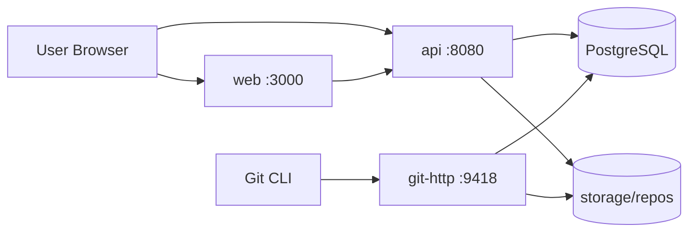

# Project Structure

## Overview

Deluxe is a **monorepo** with three deployable applications and shared infrastructure config. Git objects live on the filesystem; metadata lives in PostgreSQL.

```
deluxe/
├── apps/
│   ├── api/                    # REST API service
│   ├── git-http/               # Git protocol service
│   └── web/                    # Frontend SPA
├── db/migrations/              # SQL migrations (source of truth for schema)
├── docs/                       # Design documentation
├── scripts/                    # Local dev helpers
├── storage/repos/              # Bare .git repos (not committed)
├── docker-compose.yml
├── Makefile
└── .env.example
```

---

## `apps/api` — REST API

Handles authentication, authorization, and repository metadata. Does **not** serve Git pack files.

```
apps/api/
├── cmd/
│   └── server/
│       └── main.go             # Entry point
├── internal/
│   ├── auth/                   # JWT, sessions, PAT validation
│   │   ├── jwt.go
│   │   ├── password.go
│   │   └── pat.go
│   ├── config/
│   │   └── config.go           # Env-based configuration
│   ├── db/
│   │   ├── postgres.go         # Connection pool
│   │   └── queries/            # sqlc or raw query files
│   ├── handler/                # HTTP handlers (thin)
│   │   ├── auth_handler.go
│   │   ├── user_handler.go
│   │   └── repo_handler.go
│   ├── middleware/
│   │   ├── auth.go             # Session / PAT middleware
│   │   ├── cors.go
│   │   └── logging.go
│   ├── model/                  # Domain structs (DB row mapping)
│   │   ├── user.go
│   │   ├── session.go
│   │   ├── repository.go
│   │   └── token.go
│   ├── repository/             # Data access layer
│   │   ├── user_repo.go
│   │   ├── session_repo.go
│   │   └── repo_repo.go
│   ├── service/                # Business logic
│   │   ├── auth_service.go
│   │   ├── user_service.go
│   │   ├── repo_service.go
│   │   └── git_read_service.go # Read trees/commits from bare repos
│   └── gitstore/               # Filesystem Git operations (read-only for API)
│       ├── bare_repo.go
│       └── tree.go
├── go.mod
├── go.sum
└── Dockerfile
```

### API route groups (planned)

| Prefix | Responsibility |
|--------|----------------|
| `POST /auth/register` | User signup |
| `POST /auth/login` | Create session |
| `POST /auth/logout` | Revoke session |
| `GET /users/me` | Current user profile |
| `GET/POST /users/me/tokens` | PAT management |
| `GET/POST /repos` | List / create repositories |
| `GET /repos/:owner/:name` | Repo detail |
| `GET /repos/:owner/:name/tree` | File tree at ref |
| `GET /repos/:owner/:name/blob` | File content at ref |
| `GET /repos/:owner/:name/commits` | Commit history |

---

## `apps/git-http` — Git Smart HTTP

Implements `git-upload-pack` (clone/pull) and `git-receive-pack` (push). Authenticates via PAT on every request.

```
apps/git-http/
├── cmd/
│   └── server/
│       └── main.go
├── internal/
│   ├── auth/
│   │   └── pat.go              # Validate PAT + check repo ACL
│   ├── config/
│   │   └── config.go
│   ├── hook/
│   │   └── post_receive.go     # Update repo metadata after push
│   └── protocol/
│       ├── router.go           # Route /:owner/:repo.git
│       ├── upload_pack.go      # clone / pull
│       └── receive_pack.go     # push
├── go.mod
├── go.sum
└── Dockerfile
```

### Git URL format

```
https://localhost:9418/{owner}/{repo}.git
```

Auth header: `Authorization: Bearer pat_xxx` or Git credential helper.

---

## `apps/web` — Frontend

Next.js App Router UI for auth, dashboard, and code browsing.

```
apps/web/
├── src/
│   ├── app/                    # Next.js routes
│   │   ├── layout.tsx
│   │   ├── page.tsx            # Landing / dashboard
│   │   ├── login/
│   │   ├── register/
│   │   ├── settings/
│   │   │   └── tokens/
│   │   └── [owner]/
│   │       └── [repo]/
│   │           ├── page.tsx    # Repo home (README)
│   │           ├── tree/       # File browser
│   │           └── commits/    # Commit list
│   ├── components/
│   │   ├── auth/
│   │   ├── layout/
│   │   ├── repo/
│   │   │   ├── FileTree.tsx
│   │   │   ├── FileViewer.tsx
│   │   │   └── CommitList.tsx
│   │   └── ui/                 # Shared primitives (Button, Input, etc.)
│   ├── lib/
│   │   ├── api.ts              # API client
│   │   └── auth.ts             # Session helpers
│   └── types/
│       └── index.ts            # Shared TypeScript types
├── public/
├── package.json
├── tsconfig.json
├── next.config.ts
└── Dockerfile
```

---

## `db/migrations`

Ordered SQL files applied by `scripts/migrate.sh`. Naming: `NNN_description.up.sql` / `NNN_description.down.sql`.

| Migration | Contents |
|-----------|----------|
| `001_init` | users, sessions, repositories |
| `002_tokens` | personal_access_tokens, ssh_public_keys |
| `003_audit` | audit_events (optional) |

---

## `storage/repos`

Runtime directory for bare Git repositories. Layout:

```
storage/repos/
└── {repo_uuid}.git/            # Bare repo (stable path from DB storage_path)
```

Not committed to git. Mounted as a Docker volume in production.

---

## `scripts/`

| Script | Purpose |
|--------|---------|
| `dev.sh` | Start all services locally |
| `migrate.sh` | Run goose/golang-migrate against DATABASE_URL |
| `init-repo.sh` | Create bare repo on filesystem after DB insert |

---

## Cross-Cutting Concerns

### Authentication flow

```
Browser ──session cookie──▶ API
Git CLI ──PAT header───────▶ git-http ──▶ DB (validate token + ACL)
```

### Push flow

```
git push ─▶ git-http ─▶ receive-pack ─▶ storage/repos/{id}.git
                    └──▶ post-receive hook ─▶ UPDATE repositories (pushed_at, size_bytes)
```

### Shared packages (future)

If `api` and `git-http` share Go code (models, auth), extract to:

```
packages/go/
└── shared/
    ├── model/
    └── auth/
```

For MVP, duplicate minimally or use a Go workspace (`go.work`).

---

## Deployment Topology (MVP)



---

## Out of Scope (Folder-wise)

These are **not** created in MVP but reserved for later:

```
apps/worker/          # Background jobs (email, GC, webhooks)
apps/ssh-gateway/     # Git over SSH
packages/proto/       # gRPC definitions
infra/terraform/      # Cloud provisioning
```
