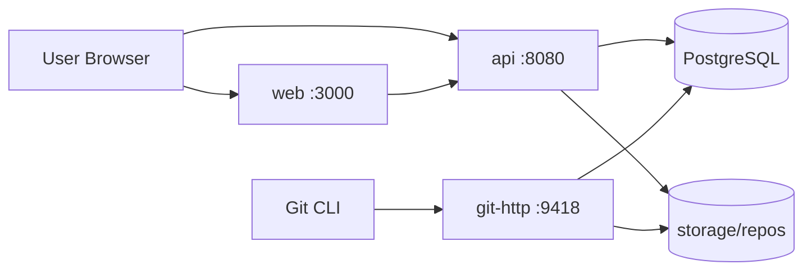

# Project Structure

> **Note:** [PROJECT.md](../PROJECT.md) §10 is the source of truth for structure and scope.

## Overview

Deluxe is a **monorepo** with three deployable applications and shared infrastructure config. Git objects live on the filesystem; metadata lives in PostgreSQL. **All application code is JavaScript** (Node.js) — Go is not used.

```
deluxe/
├── package.json                # npm workspaces root
├── apps/
│   ├── api/                    # Express REST API
│   ├── git-http/               # Express Git protocol service
│   └── web/                    # Next.js frontend
├── db/migrations/              # SQL migrations (source of truth for schema)
├── docs/                       # Design documentation
├── scripts/                    # Local dev helpers
├── storage/repos/              # Bare .git repos (not committed)
├── docker-compose.yml
├── Makefile
└── .env.example
```

---

## `apps/api` — REST API (Express.js)

Handles authentication, authorization, and repository metadata. Does **not** serve Git pack files.

```
apps/api/
├── src/
│   ├── index.js                # Entry point, Express app setup
│   ├── auth/
│   │   ├── password.js         # bcrypt hashing
│   │   ├── session.js          # Session token generation
│   │   └── pat.js              # PAT generation + validation
│   ├── config/
│   │   └── index.js            # Env-based configuration
│   ├── db/
│   │   └── postgres.js         # pg connection pool
│   ├── routes/
│   │   ├── index.js            # Route aggregator
│   │   ├── auth.js             # /auth/*
│   │   ├── users.js            # /users/*
│   │   └── repos.js            # /repos/*
│   ├── middleware/
│   │   ├── auth.js             # Session / PAT middleware
│   │   ├── cors.js
│   │   └── logging.js
│   ├── models/
│   │   └── index.js            # JSDoc type definitions
│   ├── repositories/
│   │   ├── userRepository.js
│   │   ├── sessionRepository.js
│   │   └── repoRepository.js
│   ├── services/
│   │   ├── authService.js
│   │   ├── userService.js
│   │   └── repoService.js
│   └── gitstore/
│       ├── bareRepo.js
│       └── tree.js
├── package.json
└── Dockerfile
```

### API route groups (planned)

| Prefix | Responsibility |
|--------|----------------|
| `POST /auth/register` | User signup |
| `POST /auth/login` | Create session |
| `POST /auth/logout` | Revoke session |
| `GET /users/me` | Current user profile |
| `GET/POST /users/me/tokens` | PAT management |
| `GET/POST /repos` | List / create repositories |
| `GET /repos/:owner/:name` | Repo detail |
| `GET /repos/:owner/:name/tree` | File tree at ref |
| `GET /repos/:owner/:name/blob` | File content at ref |
| `GET /repos/:owner/:name/commits` | Commit history |

---

## `apps/git-http` — Git Smart HTTP (Express.js)

Implements `git-upload-pack` (clone/pull) and `git-receive-pack` (push). Authenticates via PAT on every request.

```
apps/git-http/
├── src/
│   ├── index.js                # Entry point
│   ├── auth/
│   │   └── pat.js              # Validate PAT + check repo ACL
│   ├── config/
│   │   └── index.js
│   ├── db/
│   │   └── postgres.js
│   ├── hook/
│   │   └── postReceive.js      # Update repo metadata after push
│   └── protocol/
│       ├── router.js           # Route /:owner/:repo.git
│       ├── uploadPack.js       # clone / pull
│       └── receivePack.js      # push
├── package.json
└── Dockerfile
```

### Git URL format

```
https://localhost:9418/{owner}/{repo}.git
```

Auth header: `Authorization: Bearer pat_xxx` or Git credential helper.

---

## `apps/web` — Frontend (JavaScript)

Next.js App Router UI for auth, dashboard, and code browsing. All source files are **JavaScript** (`.js` / `.jsx`).

```
apps/web/
├── src/
│   ├── app/                    # Next.js routes
│   │   ├── layout.jsx
│   │   ├── page.jsx            # Landing / dashboard
│   │   ├── login/
│   │   ├── register/
│   │   ├── settings/
│   │   │   └── tokens/
│   │   └── [owner]/
│   │       └── [repo]/
│   │           ├── page.jsx    # Repo home (README)
│   │           ├── tree/       # File browser
│   │           └── commits/    # Commit list
│   ├── components/
│   │   ├── auth/
│   │   ├── layout/
│   │   ├── repo/
│   │   │   ├── FileTree.jsx
│   │   │   ├── FileViewer.jsx
│   │   │   └── CommitList.jsx
│   │   └── ui/                 # Shared primitives (Button, Input, etc.)
│   └── lib/
│       ├── api.js              # API client
│       └── auth.js             # Session helpers
├── public/
├── package.json
├── jsconfig.json
├── next.config.mjs
└── Dockerfile
```

---

## `db/migrations`

Ordered SQL files applied by `scripts/migrate.sh`. Naming: `NNN_description.up.sql` / `NNN_description.down.sql`.

| Migration | Contents |
|-----------|----------|
| `001_init` | users, sessions, repositories |
| `002_tokens` | personal_access_tokens, ssh_public_keys |
| `003_audit` | audit_events (optional) |

---

## `storage/repos`

Runtime directory for bare Git repositories. Layout:

```
storage/repos/
└── {repo_uuid}.git/            # Bare repo (stable path from DB storage_path)
```

Not committed to git. Mounted as a Docker volume in production.

---

## `scripts/`

| Script | Purpose |
|--------|---------|
| `dev.sh` | Print dev startup instructions |
| `migrate.sh` | Run SQL migrations against DATABASE_URL |
| `init-repo.sh` | Create bare repo on filesystem after DB insert |

---

## Cross-Cutting Concerns

### Authentication flow

```
Browser ──session cookie──▶ API (Express)
Git CLI ──PAT header───────▶ git-http (Express) ──▶ DB (validate token + ACL)
```

### Push flow

```
git push ─▶ git-http ─▶ receive-pack ─▶ storage/repos/{id}.git
                    └──▶ post-receive hook ─▶ UPDATE repositories (pushed_at, size_bytes)
```

### Shared packages (future)

If `api` and `git-http` share code (models, auth, db), extract to:

```
packages/shared/
├── package.json
└── src/
    ├── auth/
    ├── db/
    └── models/
```

For MVP, duplicate minimally or import from `packages/shared` via npm workspaces.

---

## Deployment Topology (MVP)



---

## Out of Scope (Folder-wise)

These are **not** created in MVP but reserved for later:

```
apps/worker/          # Background jobs (email, GC, webhooks)
apps/ssh-gateway/     # Git over SSH
packages/proto/       # gRPC definitions
infra/terraform/      # Cloud provisioning
```
